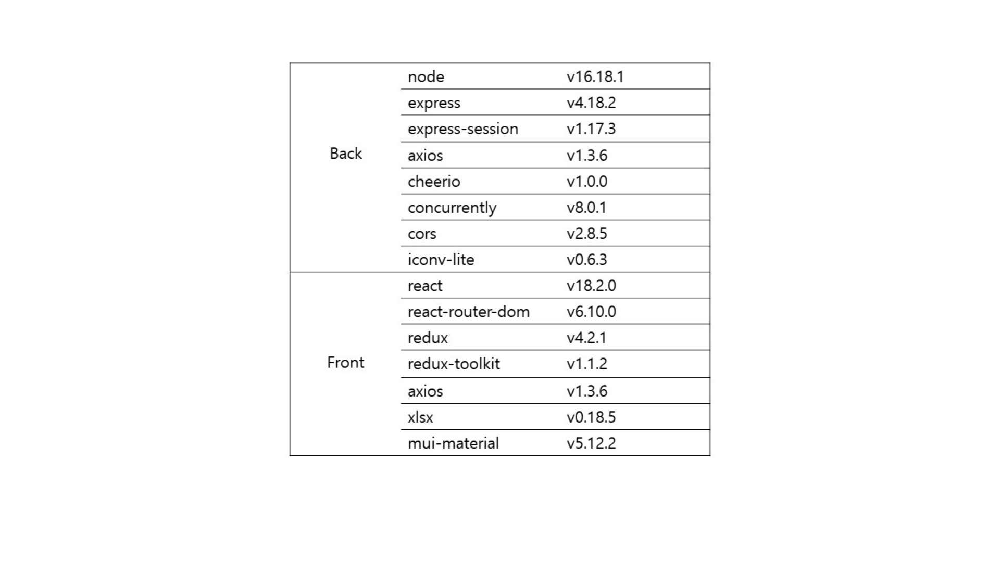
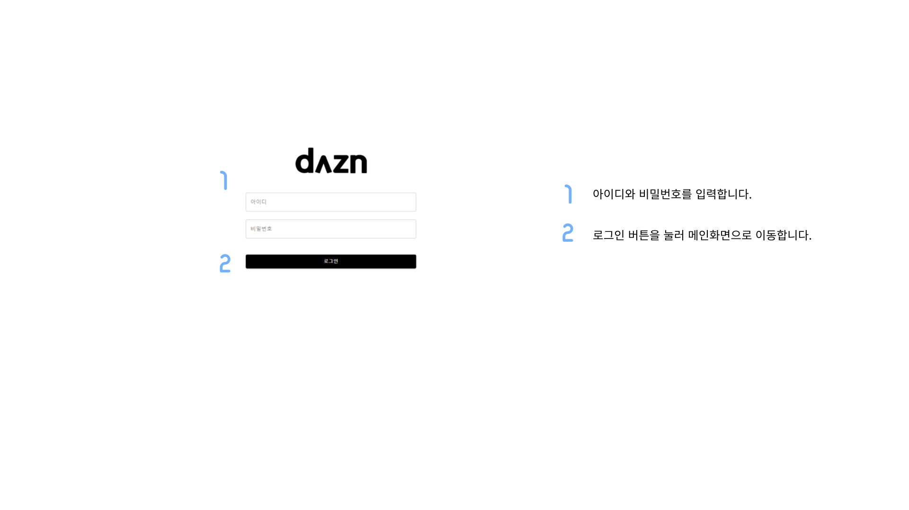
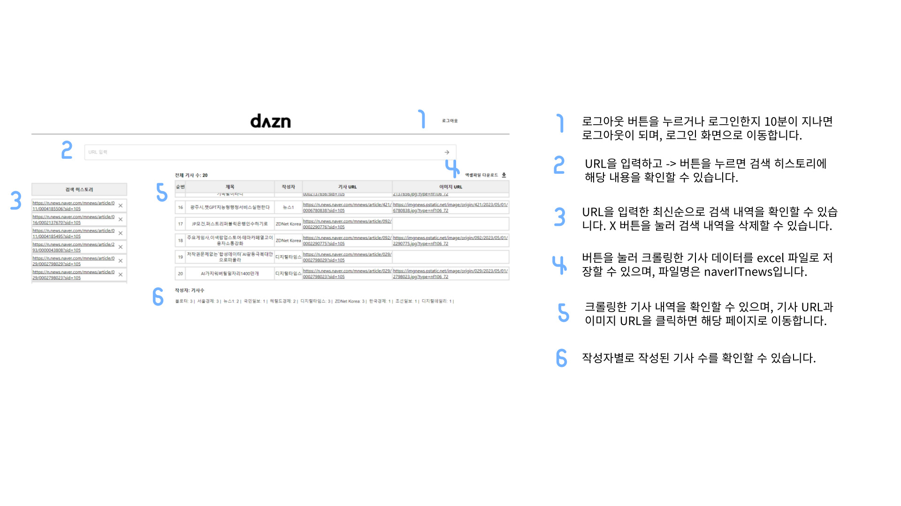

# 🗞 News-Crawling

로그인을 세션을 통해 관리하고, 네이버 IT 뉴스를 크롤링하여 보여주는 프로젝트입니다.

## ✒️ 사용 방법

1. Repository를 복제합니다.
2. `npm install`로 node_modules을 설치합니다.
3. `node server.js` 로 express 서버를 시작합니다.
4. 새 터미널을 열어 `cd client` 명령어로 client 파일로 이동합니다.
5. `npm start`로 React 서버를 시작합니다.
6. 웹 브라우저에서 <http://localhost:3000> 로 이동합니다.

## ✒️ 라이브러리

## ✒️ 화면 소개

반응형 웹으로 제작되었으며, 태블릿과 모바일 버전 모두 기능은 동일합니다.

